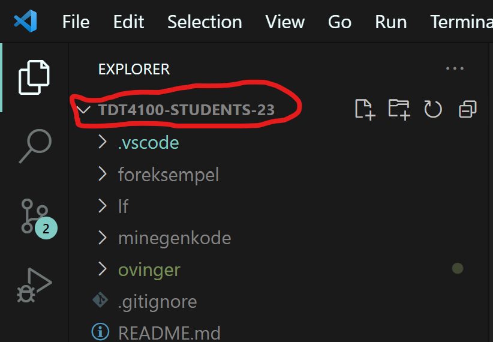
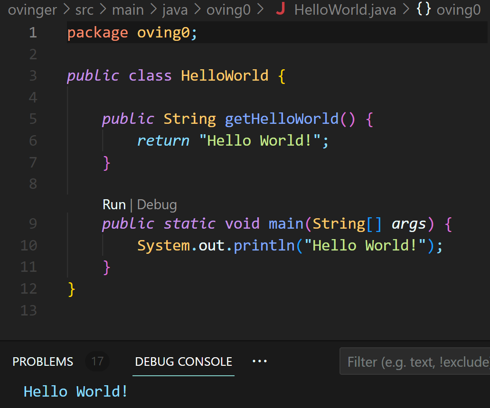
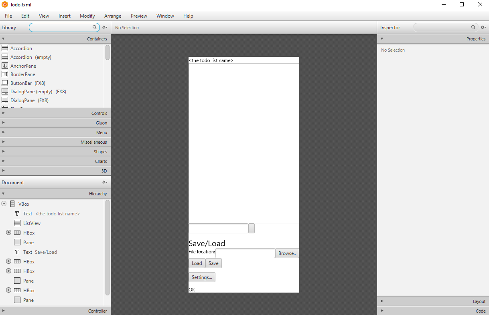
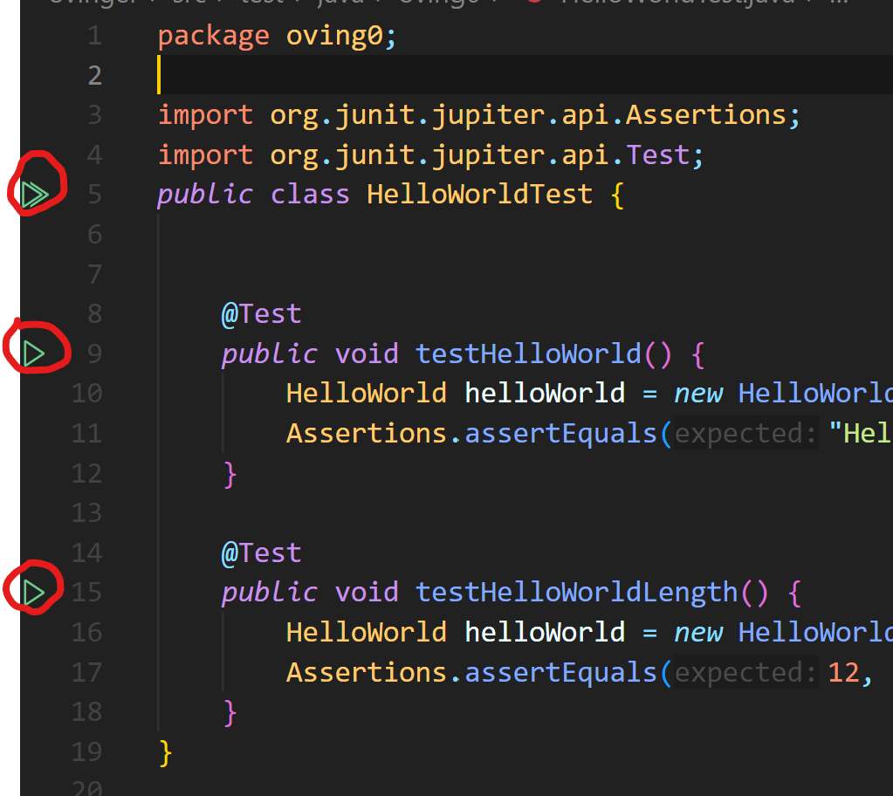
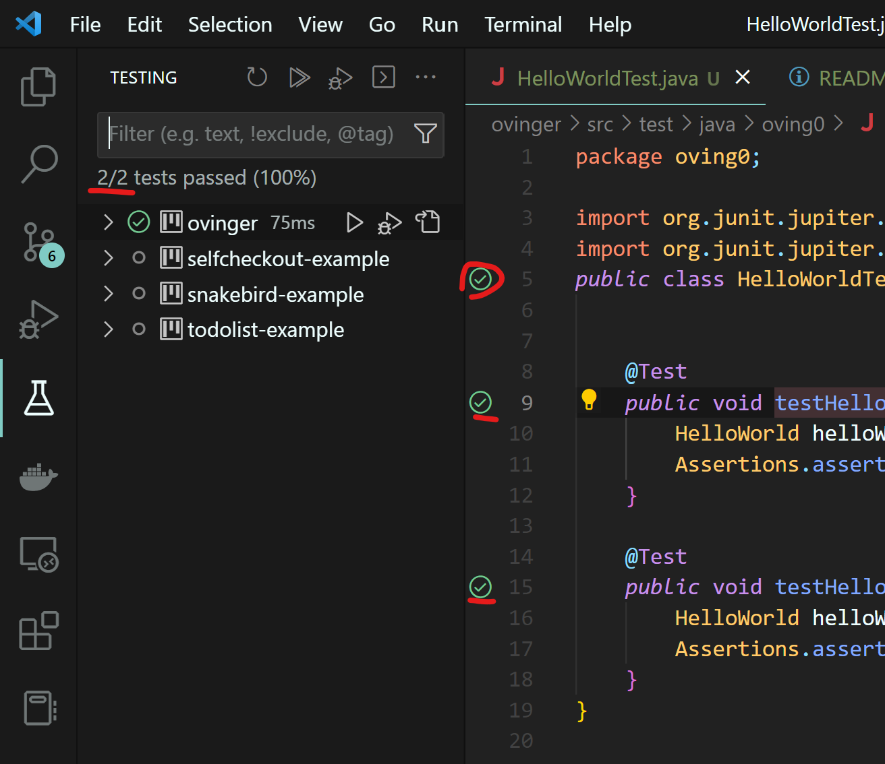

# Øving 0: Oppsett av Java

Denne øvingen er valgfri og ikke en del av det tellende øvingsopplegget. Øvingen er ment som en introduksjon til Java og hvordan du kan komme i gang med å programmere i Java. Du skal installere Java Development Kit (JDK) og kjøre enkle Java-programmer. Du skal også lære grunnleggende forskjell på Java og Python, og oversette Python-kode til Java.

**Øvingsmål**:

- Intallere Java Development kit
- Installere og sette opp VS Code og Git
- Lære grunnleggende forskjell på Java og Python, og oversette Python-kode til Java
- Kjøre og kompilere Java-kode
- Kjøre enhetstester for å sjekke at koden fungerer som den skal

## Del 1: Installere JDK og VS Code

For å kunne programmere i Java må du installere Java Development Kit (JDK). Vi kommer til å bruke VS Code som koderedigeringsverktøy i TDT4100.

- Gå inn på [denne siden](https://www.ntnu.no/wiki/x/Fgb6DQ) og følg instruksjonene for å installere JDK og VS Code. Husk å følge instruksjonene for ditt operativsystem.

## Del 2: Sette opp øvingsprosjektet

For å kunne gjøre øvingene i TDT4100 må du sette opp et prosjekt i VS Code. Dette gjør du ved å følge instruksjonene på [denne siden](https://www.ntnu.no/wiki/x/Ggb6DQ). Husk å følge instruksjonene for ditt operativsystem.

## Del 3: Hello world

For å teste at du har installert JDK og VS Code riktig, og satt opp prosjektet riktig, skal du nå kjøre et enkelt program som skriver ut "Hello world!" til konsollen.

- Åpne øvingsprosjektet i VS Code. Sørg for at mappen `TDT4100-STUDENTS-23` er den ytteste mappen i VS Code:
  

- Åpne filen [ovinger/src/main/java/oving0/HelloWorld.java](../../src/main/java/oving0/HelloWorld.java).
  Denne filen inneholder et enkelt program som skriver ut "Hello world!" til konsollen. Klikk på "Run" knappen i VS Code for å kjøre programmet. Du skal nå se "Hello world!" i konsollen:

## Del 4: JavaFX og SceneBuilder

### JavaFX

For å teste at JavaFX er installert riktig, skal du nå kjøre et enkelt program som bruker JavaFX. Åpne filen [applikasjoner\todolist-example\src\main\java\todolist\fxui\TodoApp.java](../../../applikasjoner/todolist-example/src/main/java/todolist/fxui/TodoApp.java). Klikk på "Run" knappen i VS Code for å kjøre programmet. Du skal nå se en todolist applikasjon. Hvis du får en feilmelding i VS Code, prøv å trykke ctrl/cmd+shift+p og skriv "Java: Clean the Java language server workspace" og trykk enter. Hvis du fortsatt får feilmelding, prøv å lukke VS Code og åpne det på nytt.

### SceneBuilder

Følg instruksjonene på [denne siden](https://www.ntnu.no/wiki/x/LAMxDg) for å installere SceneBuilder. Scene Builder er et verktøy som kan brukes til å designe brukergrensesnitt for JavaFX-applikasjoner. SceneBuilder er ikke nødvendig for å gjøre øvingene, men det vil være nyttig i prosjektet.

For å teste at SceneBuilder er installert riktig, skal du nå åpne todolist-applikasjonen i Scene Builder. Åpne SceneBuilder programmet, og klikk "Open Project". Naviger frem til filen [applikasjoner\todolist-example\src\main\resources\todolist\fxui\Todo.fxml](../../../applikasjoner/todolist-example/src/main/resources/todolist/fxui/Todo.fxml) og velg den. Du skal nå se todolist-applikasjonen i Scene Builder:

## Del 5: Kjøre enhetstester

Enhetstester er en måte å sjekke at koden fungerer som den skal. I øvingene i TDT4100 følger det med enhetstester for hver oppgave. For å sjekke at prosjetet ditt er satt opp riktig, skal du kjøre enhetstester for Hello world-programmet.

- Åpne filen [ovinger/src/test/java/oving0/HelloWorldTest.java](../../src/test/java/oving0/HelloWorldTest.java). Denne filen inneholder enhetstester for Hello world-programmet. For å kjøre alle testene klikker man på den øverste grønne dobbel-pilen i VS Code. Man kan også kjøre en og en test ved å klikke på den grønne enkelt-pilen ved siden av hver test:
  

- Etter å ha kjørt testene skal du se at alle testene er grønne, og at det står 2/2 tests passed i vinduet som åpner seg til venstre:
  

## Del 6: Java vs Python

I denne delen skal du lære grunnleggende forskjell på Java og Python, og oversette Python-kode til Java.
Forstett i [denne filen](./python_vs_java.md).

## Del 7: Videre lesing

Har du kommet til denne delen er du nok klar for å starte på de ordentlige øvingene. Vi anbefaler også at du blir litt kjent med Wiki-sidene, spesielt [Objektorientert programmering](https://www.ntnu.no/wiki/x/wRzuAw), [Java programmering](https://www.ntnu.no/wiki/x/zx3uAw) og [Prosedyreorientert programmering](https://www.ntnu.no/wiki/x/qx3uAw). Det er ikke forventet at dere skal lese alt som står på alle undersidene her, men det er greit å ha en oversikt over hva som er der, så vet dere hvor dere kan finne informasjon om dere trenger det.

Lykke til med øvingene!
